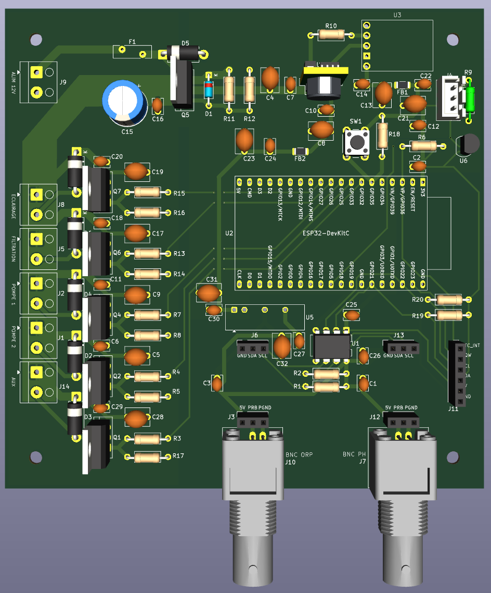

<h1> ESP32 Pool Controller</h1>

Disclaimer : projet en cours de construction.

Contrôleur automatique de piscine basé sur ESP32 :
- mesure : température, pH, ORP
- pilotage : pompe de filtration, éclairage
- correction avec pompes doseuses : pH et ORP
- interfaces : application web locale, MQTT, API

## 🎯 Fonctionnalités

### Mesures et Contrôle
- **pH** : Mesure via module numérique Atlas Scientific **EZO pH** (I²C). La température de l'eau est transmise au module pour la compensation de température de la mesure.
- **ORP (Redox)** : Mesure via module numérique Atlas Scientific **EZO ORP** (I²C)
- **Température** : Deux sondes Dallas **DS18B20** (eau + circuit/boîtier), identification automatique des rôles sur le bus OneWire
- **Historique** : Historique des mesures
- **Mode d'installation** : Décrit le câblage réel du contrôleur et garantit qu'aucun produit n'est injecté sans circulation d'eau — *PoolController pilote la filtration* (sortie 12 V), *Alimenté par le circuit de filtration*, ou *Filtration externe signalée* (une domotique tierce signale l'état via HTTP/MQTT ; dosage suspendu sans signal récent)
- **Filtration** : Programmation automatique en fonction de la température de l'eau, programmation horaire, manuel
- **Eclairage** : Programmation horaire, manuel
- **Régulation automatique de pH et ORP** : Injection de produit de correction (pH-, chlore liquide) par **régulation proportionnelle temporisée (P)** avec pause de mélange et contrôle de débit PWM. Les mesures sont **lissées** (médiane + EMA) avant d'alimenter la régulation. *(pH+ : option de configuration présente mais non gérée actuellement.)*
- **Consommation de produits** : Estimation de la consommation de produit
- **Application Web locale** : Configuration et visualisation temps réel. Accessible sur le réseau Wifi configuré (`http://poolcontroller.local`) ou un réseau Wifi de en mode point d'accès (`http://192.168.4.1`). Aucune dépendance au Cloud. [Voir les screenshots](screenshots/)
- **API** : Toutes les fonctionnalités sont exposées avec une API
- **MQTT** : Exposition des données sur MQTT. Auto-discovery HomeAssistant.
- **Mise à jour OTA** : Mise à jour firmware via interface web

### Sécurité
- ⚠️ **Limites journalières** : Protection contre le surdosage
- ⚠️ **Limites horaires** : Temps maximum d'injection par heure configurable
- ⚠️ **Watchdog** : Redémarrage automatique en cas de blocage du système (30s)
- ⚠️ **Alertes MQTT** : Notifications en cas d'anomalie

## 📋 Matériel Requis

### PCB

Les fichiers pour la partie électronique sont disponibles dans le dossier [`hardware/`](hardware/) :

- [Schéma électronique](screenshots/Schema.png)
- [PCB](screenshots/PCB.png)
- [Fichiers Gerber](hardware/Gerber.zip)
- [BOM](hardware/BOM.csv)



### Boîtier

Les fichiers STL pour l’impression 3D du boîtier sont disponibles dans le dossier [`hardware/`](hardware/) :

- [`esp32-pool-controller v3-Boitier.stl`](hardware/esp32-pool-controller%20v3-Boitier.stl) — Corps du boîtier
- [`esp32-pool-controller v3-Couvercle.stl`](hardware/esp32-pool-controller%20v3-Couvercle.stl) — Couvercle

## 🚀 Installation

### PlatformIO (Recommandé)

1. **Cloner le projet**
   ```bash
   git clone https://github.com/niko34/esp32-pool-controller.git
   cd esp32-pool-controller
   ```

2. **Ouvrir avec VS Code + PlatformIO**
   ```bash
   code .
   ```

3. **Compiler et déployer**

   **Via USB** (obligatoire pour la première installation — bootloader et table de partitions) :
   ```bash
   ./deploy.sh all       # Compile et upload firmware + filesystem
   ./deploy.sh firmware  # Firmware uniquement
   ./deploy.sh fs        # Filesystem uniquement
   ```

   **Via WiFi OTA** (mises à jour suivantes, une fois la première installation USB effectuée) :
   ```bash
   ./deploy.sh ota-all       # Compile et envoie firmware + filesystem
   ./deploy.sh ota-firmware  # Firmware uniquement
   ./deploy.sh ota-fs        # Filesystem uniquement
   ```

   Voir [UPDATE_GUIDE.md](docs/UPDATE_GUIDE.md) pour plus de détails sur les méthodes de mise à jour.

4. **Moniteur série**
   ```bash
   pio device monitor -b 115200
   ```

### Première connexion et accès à l'interface Web

1. **Première connexion**
   - Au démarrage, l'ESP32 crée un point d'accès WiFi `PoolControllerAP`
   - Le mot de passe WiFi AP est **unique par appareil**, généré aléatoirement au premier boot et stocké en NVS
   - Il s'affiche en clair dans le moniteur série **tant que le wizard de configuration n'est pas complété** :
     ```
     [INFO] AP démarré: PoolControllerAP
     [INFO] AP Password: XXXXXXXX
     [INFO] IP AP: 192.168.4.1
     ```
   - Ouvrir le moniteur série **avant** d'alimenter l'appareil : `pio device monitor -b 115200`
   - Coller le mot de passe sur une étiquette sur le boîtier
   - Se connecter au réseau `PoolControllerAP` avec ce mot de passe et accéder à l'assistant de configuration http://192.168.4.1

   > **Après le wizard complété**, si l'AP redémarre (ex : perte WiFi), le mot de passe n'est plus affiché en clair dans les logs pour des raisons de sécurité. Utiliser l'étiquette ou l'API :
   > ```
   > GET http://poolcontroller.local/auth/ap-password
   > ```

   > **Forcer la génération d'un nouveau mot de passe AP** (ex : fabrication d'un nouvel appareil, remplacement d'étiquette) : utiliser l'option `factory` qui efface toute la flash avant de flasher.
   > ```bash
   > ./deploy.sh factory
   > pio device monitor -b 115200   # ouvrir avant d'alimenter l'appareil
   > ```
   > ⚠️ Efface **toute** la flash (firmware, filesystem, NVS, historique). À n'utiliser que sur un appareil qu'on réinitialise complètement.

2. **Accès interface web**
   - `http://poolcontroller.local` si réseau wifi configuré, sinon se connecter au réseau AP PoolControllerAP et utiliser l'adresse http://192.168.4.1
   - Onglets disponibles:
     - **Tableau de bord** : Visualisation temps réel pH/ORP/Température
     - **Filtration** : Contrôle et programmation de la pompe de filtration
     - **Éclairage** : Contrôle et programmation de l'éclairage
     - **Température** : Historique et calibration de la sonde de température
     - **pH** : Mesure, historique, calibration et réglages dosage pH
     - **ORP** : Mesure, historique, calibration et réglages dosage chlore
     - **Produits** : Suivi de la consommation des produits chimiques
     - **Paramètres** : WiFi, MQTT, heure, sécurité, régulation, système

### Calibration Capteurs

#### Calibration pH (Atlas Scientific EZO pH)

La calibration est gérée **en interne par le module EZO** (commandes I²C `Cal,...`), mémorisée dans le module lui-même — il n'y a ni offset/pente stockés côté ESP32, ni EEPROM, ni librairie analogique. Elle se déclenche depuis l'interface web, onglet **pH** → carte **Calibration** (deux sous-blocs indépendants). Le module EZO pH accepte les points **milieu (pH 7.0)**, **bas (pH 4.0)** et, optionnellement, **haut**. La régulation automatique du pH est **inhibée tant que les 2 points (mid + low) ne sont pas calibrés**.

**Calibration via l'interface web** :
1. Aller dans l'onglet **pH** → carte **Calibration**
2. Rincer la sonde à l'eau distillée, la plonger dans la solution tampon **pH 7.00**, attendre stabilisation (~1 min)
3. Cliquer sur **« Calibrer le point 7.0 »** (sous-bloc *Point milieu*)
4. Rincer la sonde, la plonger dans la solution **pH 4.00**, attendre stabilisation
5. Cliquer sur **« Calibrer le point 4.0 »** (sous-bloc *Point bas*)

> **Compensation de température** : la température de l'eau mesurée par la DS18B20 est transmise au module EZO pour compenser la mesure de pH.

Détails du workflow et des cas d'erreur : voir [docs/features/page-ph.md](docs/features/page-ph.md).

#### Calibration ORP (Atlas Scientific EZO ORP)

La calibration ORP est une commande **interne au module EZO** (`Cal,<référence>`, un seul point), déclenchée depuis l'interface web, onglet **ORP** → carte **Calibration**. Comme pour le pH, aucun offset/date n'est calculé ni stocké côté ESP32. La régulation automatique de l'ORP est **inhibée tant que le module n'est pas calibré**.

**Calibration via l'interface web** :
1. Aller dans l'onglet **ORP** → carte **Calibration**
2. Rincer la sonde à l'eau déminéralisée, la plonger dans la solution de référence ORP
3. Saisir la valeur de référence de la solution dans le champ (ex : 470 mV ; plage acceptée 0–1000 mV)
4. Attendre stabilisation (~1 min), puis cliquer sur **« Calibrer »**

Détails du workflow et des cas d'erreur : voir [docs/features/page-orp.md](docs/features/page-orp.md).

### Tuning de la régulation (Avancé)

La régulation est une **proportionnelle temporisée (P)** : seul le gain **Kp** module la vitesse, **Ki = 0** et **Kd = 0** sont impératifs (pas d'intégrale ni de dérivée). La valeur d'entrée de la régulation est la mesure **lissée** (médiane + EMA) ; le dosage est **bloqué tant que le filtre de mesure n'est pas amorcé/prêt**. Voir [applyRegulationSpeed()](src/pump_controller.cpp) et [ADR-0016](docs/adr/0016-regulation-p-temporisee-vs-pid.md).

**Gain Kp par vitesse** (sélectionnable dans Paramètres → Régulation) :

| Vitesse | Kp pH | Kp ORP |
|---------|-------|--------|
| Lente   | 4.0   | 0.15   |
| Normale | 8.0   | 0.30   |
| Rapide  | 12.0  | 0.50   |

> **Ki = 0 / Kd = 0** quelle que soit la vitesse (P temporisée pure). `integralMax` (50.0) est conservé pour une éventuelle réactivation future mais reste **inerte** tant que Ki = 0.

**Protection anti-cycling** (prolonge durée de vie des pompes) :
- Injection minimum : 30 secondes par cycle
- Pause de mélange : **15 min** (pH) / **20 min** (ORP) après chaque injection (`kPhMixingDelayMs` / `kOrpMixingDelayMs`)
- Seuils de démarrage : pH ±0.05 / ORP ±15 mV
- Seuils d'arrêt : pH ±0.01 / ORP ±2 mV
- Maximum : 20 cycles par jour

## 🏠 Intégration Home Assistant

### Auto-Discovery

Le contrôleur publie automatiquement sa configuration MQTT pour Home Assistant :

| Type | Entité | Description |
|------|--------|-------------|
| Sensor | Température | Température de l'eau (°C) |
| Sensor | pH | Valeur pH |
| Sensor | ORP | Valeur ORP (mV) |
| Binary Sensor | Filtration active | État de la pompe de filtration (ON/OFF) |
| Binary Sensor | Dosage pH actif | Pompe doseuse pH en cours d'injection |
| Binary Sensor | Dosage chlore actif | Pompe doseuse ORP en cours d'injection |
| Binary Sensor | Limite journalière pH | Limite de dosage pH atteinte |
| Binary Sensor | Limite journalière chlore | Limite de dosage ORP atteinte |
| Binary Sensor | Statut contrôleur | Disponibilité du contrôleur (online/offline) |
| Select | Mode filtration | Sélection du mode (auto / manual / force / off) |
| Switch | Filtration ON/OFF | Forçage marche/arrêt de la filtration |
| Switch | Éclairage ON/OFF | Contrôle de l'éclairage |
| Number | Consigne pH | Valeur cible pH (6.0 – 8.5, pas 0.1) |
| Number | Consigne ORP | Valeur cible ORP en mV (400 – 900, pas 10) |

### Exemple Automation

```yaml
automation:
  - alias: "Alerte pH Anormal"
    trigger:
      - platform: numeric_state
        entity_id: sensor.piscine_ph
        above: 7.6
        for: "00:15:00"
    action:
      - service: notify.mobile_app
        data:
          title: "Piscine - pH Élevé"
          message: "pH: {{ states('sensor.piscine_ph') }}"

  - alias: "Notification Limite Injection"
    trigger:
      - platform: mqtt
        topic: "pool/sensors/alerts"
    condition:
      - condition: template
        value_template: "{{ 'limit' in trigger.payload_json.type }}"
    action:
      - service: notify.mobile_app
        data:
          title: "Piscine - Alerte Sécurité"
          message: "{{ trigger.payload_json.message }}"
```

## 🔐 Sécurité

### Factory Reset (bouton physique)

En cas d'oubli du mot de passe ou de nécessité de réinitialisation complète, utiliser le bouton factory reset situé à côté de l'ESP32 sur la carte électronique.

**Procédure de réinitialisation:**

Le factory reset se déclenche pendant le fonctionnement normal de l'ESP32 (pas besoin de couper l'alimentation) :

1. **Appuyer et maintenir** le bouton factory reset
   - Le log série affiche : `Bouton reset enfoncé - maintenir 10s pour factory reset`
2. **Maintenir 10 secondes**
   - Relâcher avant 10s annule la réinitialisation (log : `factory reset annulé`)
3. L'ESP32 redémarre automatiquement
3. Suivre les instructions données plus haut dans la partie "1ère connexion"

**Ce qui est réinitialisé (partition NVS effacée entièrement) :**
- ✅ Mot de passe admin (retour à `admin`)
- ✅ Token API régénéré
- ✅ Credentials WiFi supprimés (retour en mode AP)
- ✅ Configuration MQTT effacée
- ✅ Calibrations des sondes (pH, ORP) effacées

**Ce qui N'EST PAS effacé :**
- ✅ **Mot de passe WiFi AP** — préservé intentionnellement (l'étiquette sur le boîtier reste valide)
- ✅ Fichiers JSON sur LittleFS (consignes, limites, config) — préservés
- ✅ Historique des mesures (partition séparée) — préservé

## 📈 Changelog

Voir [CHANGELOG.md](CHANGELOG.md) pour l'historique complet des versions.

## 📁 Fichiers et Scripts

### Scripts de Build et Déploiement

- **`deploy.sh`** - Script de déploiement principal
  - `./deploy.sh all` - Compile et upload USB firmware + filesystem (NVS préservée)
  - `./deploy.sh factory` - Efface toute la flash, compile et upload firmware + filesystem (génère un nouveau mot de passe AP)
  - `./deploy.sh firmware` - Compile et upload USB firmware uniquement
  - `./deploy.sh fs` - Compile et upload USB filesystem uniquement
  - `./deploy.sh ota-all` - Compile et envoie OTA (WiFi) firmware + filesystem
  - `./deploy.sh ota-firmware` - Compile et envoie OTA firmware uniquement
  - `./deploy.sh ota-fs` - Compile et envoie OTA filesystem uniquement

- **`build_fs.sh`** - Construction du filesystem LittleFS
  - Minifie automatiquement HTML/CSS/JS
  - Construit LittleFS avec la bonne taille (832 KB — 851 968 octets)
  - Utilise `data-build/` comme source (généré par minify.js)

- **`minify.js`** - Minification des fichiers web
  - Utilise des outils professionnels standards de l'industrie:
    - **html-minifier-terser** - Minification HTML
    - **Terser** - Minification JavaScript
    - **CleanCSS** - Minification CSS
  - Source: `data/` → Destination: `data-build/`
  - Exécuté automatiquement par `build_fs.sh`

### Configuration

- **`platformio.ini`** - Configuration PlatformIO
  - Définit les dépendances, ports, partitions
  - Port série: `/dev/cu.usbserial-0001` (à adapter)

- **`partitions.csv`** - Table de partitions ESP32 4MB (layout v2, [ADR-0015](docs/adr/0015-partition-app-1.5mb.md))
  - 2× slots OTA app0/app1 (1.5 MB / 1536 KB chacun)
  - LittleFS/spiffs (832 KB) pour l'interface web
  - History (64 KB) partition séparée préservée lors des mises à jour

### Documentation

- **[`docs/API.md`](docs/API.md)** - Documentation de l'API REST
- **[`docs/MQTT.md`](docs/MQTT.md)** - Documentation des topics MQTT
- **[`docs/BUILD.md`](docs/BUILD.md)** - Instructions de compilation détaillées
- **[`docs/UPDATE_GUIDE.md`](docs/UPDATE_GUIDE.md)** - Guide de mise à jour (USB, WiFi OTA, GitHub)
- **`README.md`** - Ce fichier

### Dossiers

- **`src/`** - Code source C++ du firmware
- **`data/`** - Fichiers web sources (HTML/CSS/JS) — versionnés
- **`data-build/`** - Fichiers web minifiés — générés automatiquement (ignoré par git)
- **`hardware/`** - Fichiers Gerber, BOM et STL du boîtier
- **`kicad/`** - Schémas électroniques KiCad
- **`docs/`** - Documentation technique complémentaire
- **`screenshots/`** - Captures d'écran de l'interface
- **`tools/`** - Scripts utilitaires (ex: test UART)
- **`logo/`** - Fichiers logo du projet

## 📄 Licence

MIT License - Voir fichier LICENSE

## ⚠️ Avertissement

Ce projet est fourni "tel quel" sans garantie. L'utilisation de produits chimiques et d'équipements électriques près de l'eau présente des risques. L'utilisateur est seul responsable de:
- La conformité aux réglementations locales
- La sécurité de l'installation
- Le bon dosage des produits chimiques
- La surveillance du système

**En cas de doute, consulter un professionnel.**
