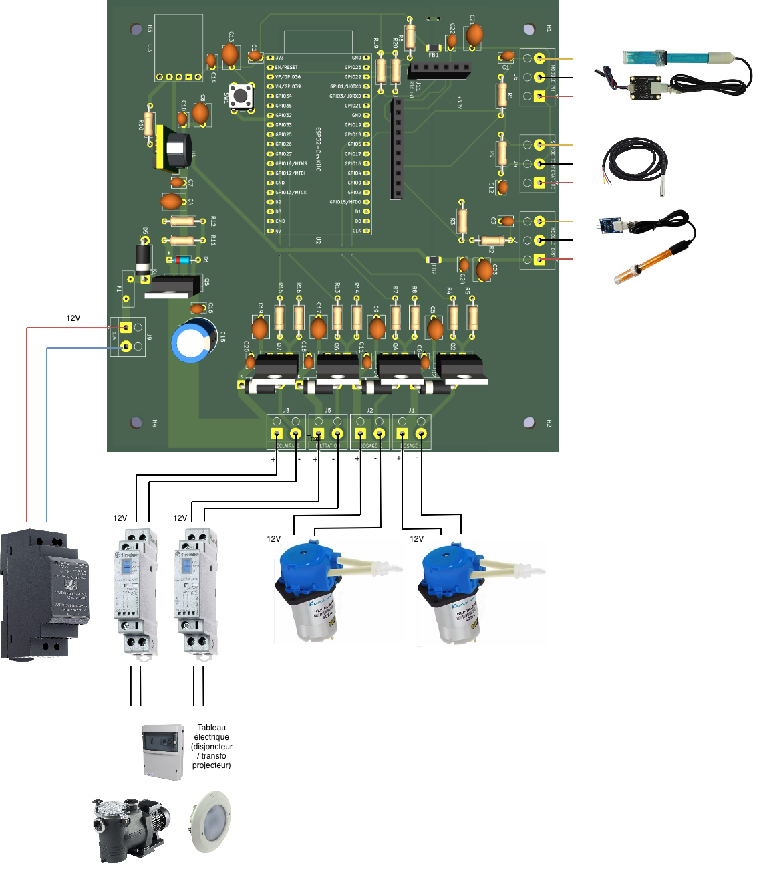

# ESP32 Pool Controller

Disclaimer : projet en cours de construction.

Contrôleur automatique de piscine basé sur ESP32 :
- mesure : température, pH, ORP
- pilotage : pompe de filtration, éclairage
- correction avec pompes doseuses : pH et ORP
- interfaces : application web locale, MQTT, API

**Version actuelle**: 1.0.3

## 🎯 Fonctionnalités

### Mesures et Contrôle
- **pH** : Mesure via capteur pH analogique avec compensation automatique de température
- **ORP (Redox)** : Mesure via capteur analogique
- **Température** : Sonde Dallas DS18B20
- **Historique** : Historique des mesures
- **Filtration** : Programmation automatique en fonction de la température de l'eau, programmation horaire, manuel
- **Eclairage** : Programmation horaire, manuel
- **Régulation automatique de pH et ORP** : Injection de produit de correction (pH-, pH+, Chlore liquide) avec régulation PID et contrôle de débit PWM.
- **Consommation de produits** : Estimation de la consommation de produit
- **Application Web locale** : Configuration et visualisation temps réel. Accessible sur le réseau Wifi configuré (`http://poolcontroller.local`) ou un réseau Wifi de en mode point d'accès (`http://192.168.4.1`). Aucune dépendance au Cloud.
- **API** : Toutes les fonctionnalités sont exposées avec une API
- **MQTT** : Exposition des données sur MQTT. Auto-discovery HomeAssistant.
- **Mise à jour OTA** : Mise à jour firmware via interface web

### Sécurité
- ⚠️ **Limites journalières** : Protection contre le surdosage
- ⚠️ **Limites horaires** : Temps maximum d'injection par heure configurable
- ⚠️ **Watchdog** : Redémarrage automatique en cas de blocage du système (30s)
- ⚠️ **Alertes MQTT** : Notifications en cas d'anomalie

## 📋 Matériel Requis

### PCB

Les fichiers Gerber et BOM pour la fabrication du PCB sont disponibles dans le dossier [`hardware/`](hardware/).

- [Schéma électronique](screenshots/Schema.png)
- [PCB](screenshots/PCB.png)



### Boîtier

Les fichiers STL pour l’impression 3D du boîtier sont disponibles dans le dossier [`hardware/`](hardware/) :

- [`esp32-pool-controller v3-Boitier.stl`](hardware/esp32-pool-controller%20v3-Boitier.stl) — Corps du boîtier
- [`esp32-pool-controller v3-Couvercle.stl`](hardware/esp32-pool-controller%20v3-Couvercle.stl) — Couvercle

## 🚀 Installation

### PlatformIO (Recommandé)

1. **Cloner le projet**
   ```bash
   git clone https://github.com/niko34/esp32-pool-controller.git
   cd esp32-pool-controller
   ```

2. **Ouvrir avec VS Code + PlatformIO**
   ```bash
   code .
   ```

3. **Compiler et déployer**

   **Option A - Déploiement complet (recommandé)**
   ```bash
   # Compile firmware + filesystem et upload tout
   ./deploy.sh all
   ```

   **Option B - Déploiement sélectif**
   ```bash
   # Firmware uniquement
   ./deploy.sh firmware

   # Filesystem uniquement (fichiers web)
   ./deploy.sh fs
   ```

   **Option C - Compilation manuelle**
   ```bash
   # 1. Compiler le firmware
   pio run

   # 2. Construire le filesystem LittleFS (avec minification auto)
   ./build_fs.sh

   # 3. Upload firmware
   pio run -t upload

   # 4. Upload filesystem
   python3 ~/.platformio/packages/tool-esptoolpy/esptool.py \
     --chip esp32 --port /dev/cu.usbserial-0001 --baud 115200 \
     write_flash 0x2B0000 .pio/build/esp32dev/littlefs.bin
   ```

   ⚠️ **Important**:
   - Ne PAS utiliser `pio run -t buildfs` ou `pio run -t uploadfs`
   - Ces commandes utilisent une mauvaise taille (128KB au lieu de 1216KB)
   - Utilisez toujours `./build_fs.sh` pour construire le filesystem
   - Le port série est configuré dans `platformio.ini` (`/dev/cu.usbserial-0001`)
   - Modifiez `upload_port` et `monitor_port` selon votre système:
     - macOS: `/dev/cu.usbserial-*` ou `/dev/cu.SLAB_USBtoUART`
     - Linux: `/dev/ttyUSB0` ou `/dev/ttyACM0`
     - Windows: `COM3`, `COM4`, etc.
   - Voir [BUILD.md](BUILD.md) et [MINIFICATION.md](MINIFICATION.md) pour plus de détails

4. **Moniteur série**
   ```bash
   pio device monitor -b 115200
   ```

### Configuration Initiale

1. **Première connexion WiFi**
   - Au démarrage, l'ESP32 crée un point d'accès `PoolControllerAP`
   - Mot de passe: `12345678`
   - Se connecter et configurer votre réseau WiFi

2. **Accès interface web**
   - `http://poolcontroller.local` (ou IP affichée dans les logs)
   - Onglets disponibles:
     - **Tableau de bord** : Visualisation temps réel pH/ORP/Température
     - **Configuration** : Réglages MQTT, consignes, limites de sécurité
     - **Historique** : Suivi des événements et alertes
     - **Logs** : Journal système avec filtrage par niveau
     - **Système** : Test manuel des pompes, mise à jour OTA, informations

3. **Configuration MQTT (optionnel)**
   - Serveur: IP de votre broker MQTT
   - Port: 1883 (par défaut)
   - Topic de base: `pool/sensors`
   - Username/Password si nécessaire

### Calibration Capteurs

#### Calibration pH (DFRobot SEN0161-V2)

Le capteur DFRobot utilise la librairie DFRobot_PH qui gère automatiquement la calibration en EEPROM.

**Calibration 1 point (pH neutre 7.0)** via l'interface web :
1. Aller dans **Configuration** → Section **Calibration pH**
2. Plonger la sonde dans solution **pH 7.0**, attendre stabilisation (30-60s)
3. Cliquer sur **"Calibrer pH Neutre"**

**Calibration 2 points (pH 4.0 et 7.0)** via l'interface web :
1. Aller dans **Configuration** → Section **Calibration pH**
2. Plonger la sonde dans solution **pH 7.0**, attendre stabilisation
3. Cliquer sur **"Calibrer pH Neutre"**
4. Rincer la sonde à l'eau distillée
5. Plonger la sonde dans solution **pH 4.0**, attendre stabilisation
6. Cliquer sur **"Calibrer pH Acide"**

> **Note** : La librairie DFRobot_PH ne supporte que pH 4.0 et 7.0. Les solutions pH 9 ou 10 ne sont pas supportées.

**Compensation de température**: La librairie applique automatiquement la compensation avec la température mesurée par la DS18B20.

#### Calibration ORP

**Via l'interface web** (onglet Configuration):

1. **Préparation**:
   - Utiliser une solution de référence ORP (généralement 470 mV à 25°C)
   - Rincer la sonde à l'eau déminéralisée
   - Plonger la sonde dans la solution de référence

2. **Calibration**:
   - Dans l'interface web, aller dans Configuration
   - Section "Calibration ORP"
   - Noter la valeur ORP actuelle affichée
   - Entrer la valeur de référence de votre solution (ex: 470 mV)
   - Cliquer sur "Calibrer ORP"
   - Le système calcule et enregistre automatiquement l'offset

3. **Vérification**:
   - La valeur ORP affichée doit maintenant correspondre à la référence
   - L'offset et la date de calibration sont sauvegardés en NVS

### Tuning PID (Avancé)

Les paramètres PID contrôlent la réactivité du dosage. Voir [pump_controller.h:26-29](src/pump_controller.h#L26-L29).

**Paramètres par défaut** (optimisés pour système avec inertie):
- **Kp** (Proportionnel): 15.0 - Réaction à l'erreur actuelle
- **Ki** (Intégral): 0.1 - Correction lente des erreurs persistantes
- **Kd** (Dérivé): 5.0 - Anticipation (freine si descend rapidement)
- **integralMax**: 50.0 - Anti-windup pour éviter accumulation excessive

**Protection anti-cycling** (prolonge durée de vie des pompes):
- Injection minimum: 30 secondes par cycle
- Pause minimum: 5 minutes entre injections
- Seuils de démarrage: pH ±0.05 / ORP ±10mV
- Seuils d'arrêt: pH ±0.01 / ORP ±2mV
- Maximum: 200 cycles par jour

## 🏠 Intégration Home Assistant

### Auto-Discovery

Le contrôleur publie automatiquement sa configuration MQTT:
- Sensor: Température
- Sensor: pH
- Sensor: ORP
- Binary Sensor: État filtration
- Select: Mode filtration (auto/manual/off)

### Exemple Automation

```yaml
automation:
  - alias: "Alerte pH Anormal"
    trigger:
      - platform: numeric_state
        entity_id: sensor.piscine_ph
        above: 7.6
        for: "00:15:00"
    action:
      - service: notify.mobile_app
        data:
          title: "Piscine - pH Élevé"
          message: "pH: {{ states('sensor.piscine_ph') }}"

  - alias: "Notification Limite Injection"
    trigger:
      - platform: mqtt
        topic: "pool/sensors/alerts"
    condition:
      - condition: template
        value_template: "{{ 'limit' in trigger.payload_json.type }}"
    action:
      - service: notify.mobile_app
        data:
          title: "Piscine - Alerte Sécurité"
          message: "{{ trigger.payload_json.message }}"
```

## 🔐 Sécurité

### Factory Reset (bouton physique)

En cas d'oubli du mot de passe ou de nécessité de réinitialisation complète, utiliser le bouton factory reset connecté à GPIO32.

**Matériel requis:**
- Bouton poussoir normalement ouvert (NO)
- Connexion: un côté à GPIO32, l'autre côté à 3.3V
- Pas besoin de résistance pull-down (déjà intégrée en interne)

**Procédure de réinitialisation:**

Le factory reset se déclenche pendant le fonctionnement normal de l'ESP32 (pas besoin de couper l'alimentation) :

1. **Appuyer et maintenir** le bouton factory reset (GPIO32)
   - Le log série affiche : `Bouton reset enfoncé - maintenir 10s pour factory reset`
   - La LED intégrée (GPIO2) clignote lentement pendant l'appui
2. **Maintenir 10 secondes**
   - Relâcher avant 10s annule la réinitialisation (log : `factory reset annulé`)
3. **Après 10 secondes**, la LED clignote rapidement 5 fois pour confirmer
4. L'ESP32 redémarre automatiquement

**Caractéristiques techniques:**
- Bouton: GPIO32 (actif haut, pull-down interne activé)
- LED feedback: GPIO2 (LED intégrée)
- Durée requise: 10 secondes
- Indication visuelle: Clignotement lent pendant l'appui, rapide (×5) à la confirmation

**Ce qui est réinitialisé (partition NVS effacée entièrement) :**
- ✅ Mot de passe administrateur → `admin`
- ✅ Token API régénéré
- ✅ Credentials WiFi supprimés (retour en mode AP)
- ✅ Configuration MQTT effacée
- ✅ Calibrations des sondes (pH, ORP) effacées

**Ce qui N'EST PAS effacé :**
- ✅ Fichiers JSON sur LittleFS (consignes, limites, config) — préservés
- ✅ Historique des mesures (partition séparée) — préservé

**Note importante:** GPIO32 est un GPIO libre qui ne nécessite pas de précautions particulières au démarrage.

### Bonnes Pratiques

1. **Produits chimiques**
   - Utiliser pH- et chlore liquides adaptés piscines
   - Stockage bidons dans local ventilé, hors gel
   - Ajuster limites journalières selon volume piscine

2. **Électricité**
   - Boîtier étanche IP65 minimum
   - Relais filtration avec protection 16A
   - Disjoncteur différentiel 30mA obligatoire

3. **Maintenance**
   - Calibrer sondes pH/ORP tous les 3 mois
   - Nettoyer électrodes mensuellement (solution acide pH)
   - Vérifier tubing pompes (usure, fuites)

4. **Monitoring**
   - Activer alertes MQTT
   - Vérifier logs quotidiennement (premiers jours)
   - Tester sécurités (déconnecter sonde → alerte?)

## 📈 Changelog

Voir [CHANGELOG.md](CHANGELOG.md) pour l'historique complet des versions.

## 📁 Fichiers et Scripts

### Scripts de Build et Déploiement

- **`deploy.sh`** - Script de déploiement principal
  - `./deploy.sh all` - Build et upload firmware + filesystem
  - `./deploy.sh firmware` - Build et upload firmware uniquement
  - `./deploy.sh fs` - Build et upload filesystem uniquement

- **`build_fs.sh`** - Construction du filesystem LittleFS
  - Minifie automatiquement HTML/CSS/JS (économie ~92KB / 15%)
  - Construit LittleFS avec la bonne taille (1216KB)
  - Utilise `data-build/` comme source (généré par minify.js)

- **`minify.js`** - Minification des fichiers web
  - Utilise des outils professionnels standards de l'industrie:
    - **html-minifier-terser** - Minification HTML
    - **Terser** - Minification JavaScript
    - **CleanCSS** - Minification CSS
  - Source: `data/` → Destination: `data-build/`
  - Exécuté automatiquement par `build_fs.sh`

### Configuration

- **`platformio.ini`** - Configuration PlatformIO
  - Définit les dépendances, ports, partitions
  - Port série: `/dev/cu.usbserial-0001` (à adapter)

- **`partitions.csv`** - Table de partitions ESP32 4MB
  - 2× slots OTA (1344KB chacun)
  - LittleFS/spiffs (1216KB) pour interface web
  - History (128KB) partition séparée préservée lors des mises à jour

### Documentation

- **`BUILD.md`** - Instructions de compilation détaillées
- **`MINIFICATION.md`** - Détails sur le système de minification
- **`README.md`** - Ce fichier

### Dossiers

- **`src/`** - Code source C++ du firmware
- **`data/`** - Fichiers web sources (HTML/CSS/JS) - versionnés
- **`data-build/`** - Fichiers web minifiés - générés automatiquement (ignoré par git)
- **`kicad/`** - Schémas électroniques KiCad

## 🤝 Contribution

Les Pull Requests sont bienvenues ! Pour changements majeurs:
1. Ouvrir une Issue pour discussion
2. Fork le projet
3. Créer branche feature (`git checkout -b feature/AmazingFeature`)
4. Commit (`git commit -m 'Add AmazingFeature'`)
5. Push (`git push origin feature/AmazingFeature`)
6. Ouvrir Pull Request

## 📄 Licence

MIT License - Voir fichier LICENSE

## ⚠️ Avertissement

Ce projet est fourni "tel quel" sans garantie. L'utilisation de produits chimiques et d'équipements électriques près de l'eau présente des risques. L'utilisateur est seul responsable de:
- La conformité aux réglementations locales
- La sécurité de l'installation
- Le bon dosage des produits chimiques
- La surveillance du système

**En cas de doute, consulter un professionnel.**

## 📞 Support

- **Issues GitHub**: Pour bugs et demandes de fonctionnalités
- **Discussions**: Pour questions générales
- **Wiki**: Documentation détaillée (à venir)

---

**Auteur**: Nicolas Philippe
**Version**: 1.0.3
